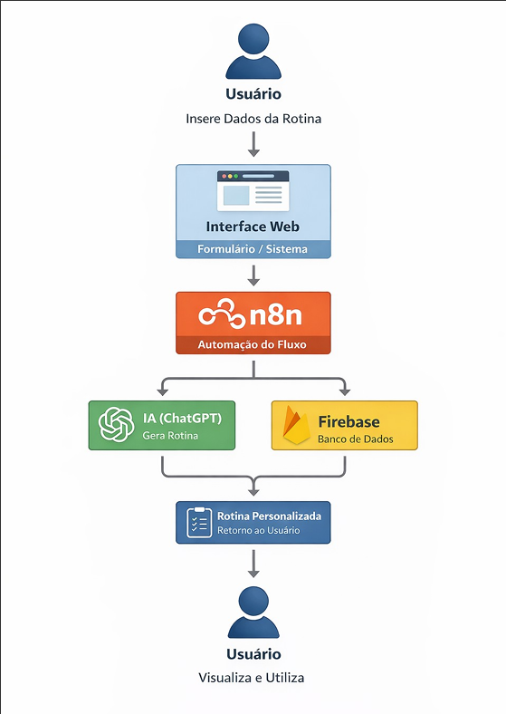

# 🤖 Organizador de Rotina com Inteligência Artificial

> Ecossistema de IA que organiza a rotina do usuário em linguagem natural, integrando **n8n**, **ChatGPT** e **Firebase**.

---

### 📋 Informações do Projeto

- **Disciplina:** Engenharia de Prompt
- **Grupo:** Vibes & Codes
- **Instituição:** Universidade Cidade de São Paulo (UNICID)
- **Integrantes:**
  - Lucas Henrique Roque Cruz
  - Matheus de Oliveira Santos
  - Renan Correia Ferreira de Souza
  - Vinicius Xavier
  - Vinicius Scherer Di Giorno
  - Matheus Chagas Mauriz Coque
  - Mariana Calderari
  - Gabriel da Silva Cesario

---

### 🎯 Problema

Muitas pessoas têm dificuldade em organizar a rotina: sobrecarga de tarefas, dificuldade em priorizar, má gestão do tempo e pouca consistência na criação de hábitos. Ferramentas tradicionais (agendas e apps de tarefas) exigem que o próprio usuário planeje tudo manualmente.

### 💡 Solução

Um organizador de rotinas com IA, acessado por chat em linguagem natural. O usuário informa horários, compromissos e prioridades, e a IA gera uma rotina personalizada, ajustável em tempo real caso surja um imprevisto.

**Público-alvo:** estudantes, profissionais, autônomos/freelancers e pessoas em geral.

---

### 🧩 Arquitetura do Ecossistema

| Camada | Tecnologia | Função |
| --- | --- | --- |
| **Interface** | Web Chat (HTML, CSS, JS) | Coleta de dados do usuário e exibição da rotina |
| **Automação** | n8n | "Cérebro operacional": recebe a mensagem, aciona a IA, grava os dados e devolve a resposta |
| **Inteligência Artificial** | ChatGPT (OpenAI) | Interpreta as necessidades e gera rotinas otimizadas |
| **Armazenamento** | Firebase Cloud Firestore | Histórico de interações, preferências e rotinas geradas |

### 🔄 Fluxo de Funcionamento

1. O usuário envia uma mensagem na interface.
2. O n8n recebe a mensagem e a encaminha para a IA.
3. A IA processa e gera a rotina personalizada.
4. O n8n armazena os dados e retorna a resposta ao usuário.

---

### 🧠 Engenharia de Prompt

O agente de IA foi configurado com um *system prompt* estruturado em seções (**Persona, Tarefa, Contexto, Regras, Importante, Banco de dados e Formato de saída**):

- **Persona:** organizador de rotina personalizado, focado em produtividade e equilíbrio.
- **Coleta inicial:** nome, idade e se estuda e/ou trabalha.
- **Informações-chave:** horário de acordar e dormir, estudo/trabalho, prática de exercícios.
- **Agendamento:** sempre pergunta a data no formato `dd/mm/aaaa` ao adicionar um compromisso.
- **Saída:** rotina em lista ou cronograma com horários definidos, equilibrando trabalho, descanso e lazer.
- **Metodologia:** segmentação do dia (manhã/tarde/noite), blocos de foco de 60 a 90 minutos e pausas de 5 a 15 minutos.
- **Adaptabilidade:** reorganiza a agenda automaticamente diante de imprevistos.

---

### 🚀 Protótipo Funcional (Telegram)

Para validar o fluxo, o workflow foi implementado no n8n com o **Telegram** como canal de conversa:

| Nó | Função |
| --- | --- |
| **Telegram Trigger** | Recebe as mensagens do usuário |
| **AI Agent** | Agente com o system prompt do organizador de rotina |
| **OpenAI Chat Model** | Modelo de linguagem (`gpt-5-mini`) |
| **Simple Memory** | Memória por usuário (janela de 20 mensagens, sessão pelo ID do Telegram) |
| **Send a text message** | Envia a rotina de volta ao usuário |

🔗 **Bot no Telegram:** [@organizador_rotinas_ia_bot](https://t.me/organizador_rotinas_ia_bot)

> ℹ️ A arquitetura completa (web chat + Firebase) está documentada no memorial. O protótipo em execução utiliza o Telegram e a memória do próprio n8n; a persistência no Firebase faz parte da evolução planejada.

---

### 📊 Viabilidade

- **Tempo de resposta estimado:** 3 a 8 segundos por interação.
- **Capacidade do protótipo:** 1 a 50 usuários simultâneos, escalável para centenas com otimizações.
- **Custo estimado:** R$ 50 a R$ 150/mês (VPS para n8n self-hosted) + custos reduzidos no Firebase (planos Spark/Blaze).

### ⚠️ Limitações

- Dependência da qualidade dos prompts e do modelo de IA utilizado.
- Dependência de APIs externas (envio de dados a terceiros, com atenção à LGPD).
- Ausência de autenticação robusta (OAuth/2FA) e de criptografia ponta a ponta no protótipo.
- Interface simples, sem suporte nativo a voz ou app mobile.

### 🔮 Melhorias Futuras

- Agentes autônomos com LangChain (lembretes, ajustes automáticos por vários dias).
- Memória de longo prazo com RAG e Vector Database.
- Integração com calendários reais (Google Calendar e Outlook).
- Autenticação com Firebase Auth e logs de auditoria.
- Uso de modelos open-source (Llama 3, DeepSeek) para reduzir custos e melhorar a privacidade.

---

### 📁 Estrutura da Pasta

- `📄 README.md`: Este arquivo.
- `📂 /docs/`: Memorial de construção e documento do projeto de ecossistema (PDF).
- `📂 /workflow/`: Workflow do n8n exportado (`workflow-organize-routine.json`), pronto para importar.
- `📂 /imagens/`: Diagrama do ecossistema.

### 📎 Documentação

- [📘 Memorial de Construção](Memorial_de_construção)
- [📗 Projeto de Ecossistema com IA](docs/projeto_ecossistema_IA.pdf)
- [⚙️ Workflow n8n (JSON)](n8n/workflow-organize-routine.json)
